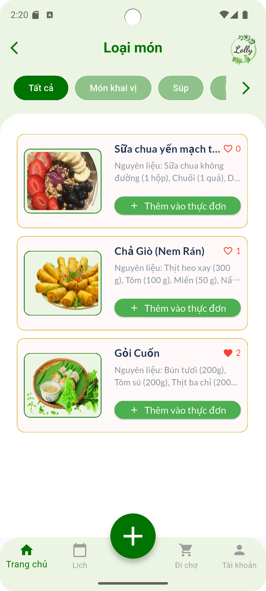
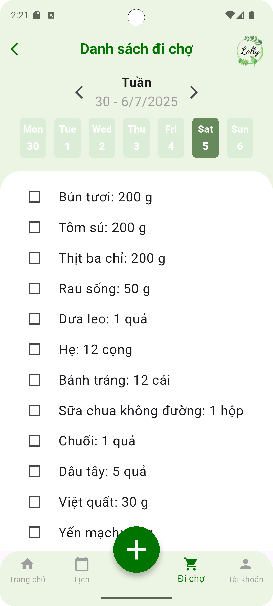
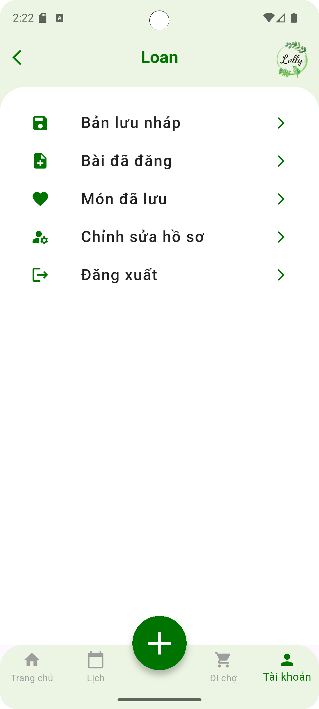
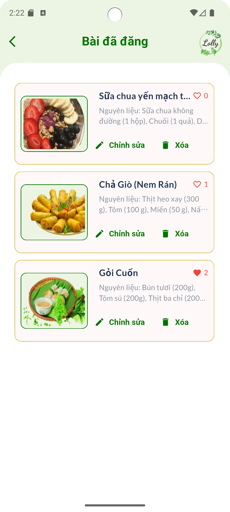
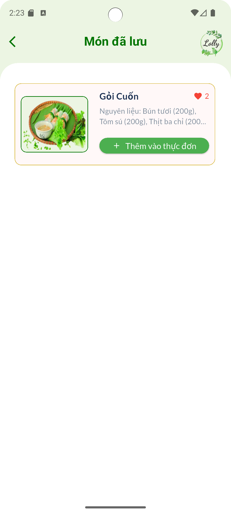
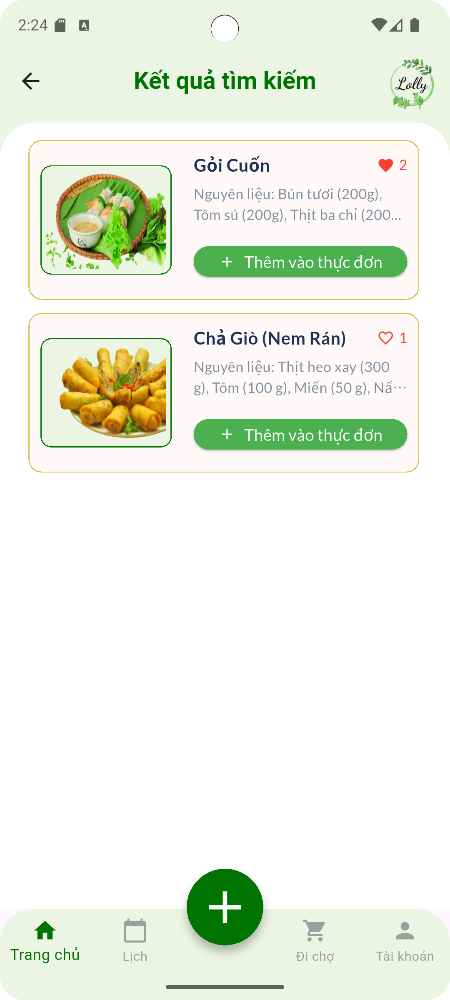

# Ứng dụng chia sẻ công thức nấu ăn
## Mô tả
Một ứng dụng di động để chia sẻ và khám phá các công thức nấu ăn. Người dùng có thể duyệt qua nhiều công thức, xem chi tiết nguyên liệu và cách làm, và chia sẻ món ăn yêu thích của họ với cộng đồng. Người dùng có thể thêm công thức vào ngày cụ thể, để tiết kiệm thời gian lên thực đơn cho ngày, có thể xem danh sách các nguyên liệu cho thực đơn ngày hôm đó.

## Thiết kế giao diện
[Xem link thiết kế tại đây](https://www.figma.com/design/Doqy6jwA0XjDcqsbYsDP7l/Lolly_app?node-id=0-1&t=OV2JdfDxju8DusmW-1)

## Chức năng hiện có
- Xem danh sách công thức: Hiển thị các công thức được chia sẻ bởi người dùng, phân loại theo món ăn, phong cách ẩm thực, chế độ ăn, thời gian nấu, v.v.
- Chi tiết công thức: Mỗi công thức có mô tả nguyên liệu, các bước chế biến, thời gian nấu, hình ảnh minh họa.
- Tìm kiếm công thức: Cho phép người dùng tìm theo tên món ăn, nguyên liệu sẵn có hoặc từ khóa.
- Quản lý thực đơn: Người dùng có thể thêm công thức vào ngày cụ thể, để tiết kiệm thời gian lên thực đơn cho ngày.
- Đăng công thức: Người dùng đã đăng nhập có thể chia sẻ công thức riêng, kèm hình ảnh và mô tả.
- Đi chợ: Người dung có thể xem danh sách các nguyên liệu cho một ngày cụ thể từ thực đơn ngày hôm đó.
- Tương tác cộng đồng: Người dùng có thể like, bình luận công thức của người khác.
- Quản lý công thức cá nhân: Xem, sửa, xoá các công thức đã đăng. Xem các công thức đã yêu thích. Xem các bản nháp đã lưu.

## Công nghệ sử dụng
- **Ngôn ngữ lập trình**: Dart, Flutter
- **Backend-as-a-Service**: Supabase (PostgreSQL, Authentication, Realtime, Storage)
- **Authentication**: Supabase Auth
- **Cơ sở dữ liệu**: Supabase Database (tương thích PostgreSQL)
- **API**: RESTful API tự động từ Supabase
- **Quản lý trạng thái**: Flutter Riverpod và GetX 

## Cách cài đặt và sử dụng
1. Clone the repository

```bash
git clone https://github.com/NguyenHongLoan125/lolly_app.git
cd lolly_app
```

2. Install dependencies

```bash
flutter pub get
```

3. Run the app

```bash
flutter run
```

## Ảnh chụp màn hình

|  |  |  |
|---|---|---|
|  |  |  |
|  |  |  |
| |


